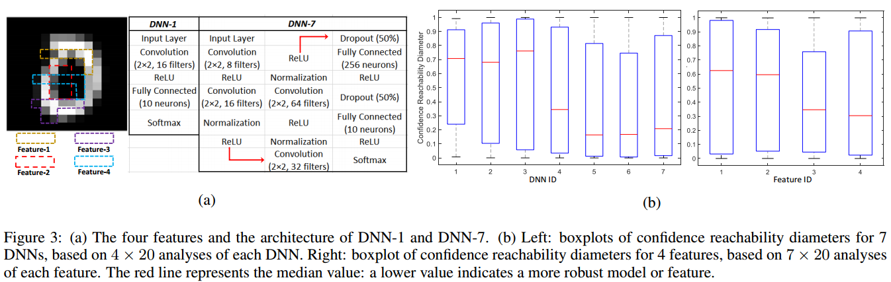
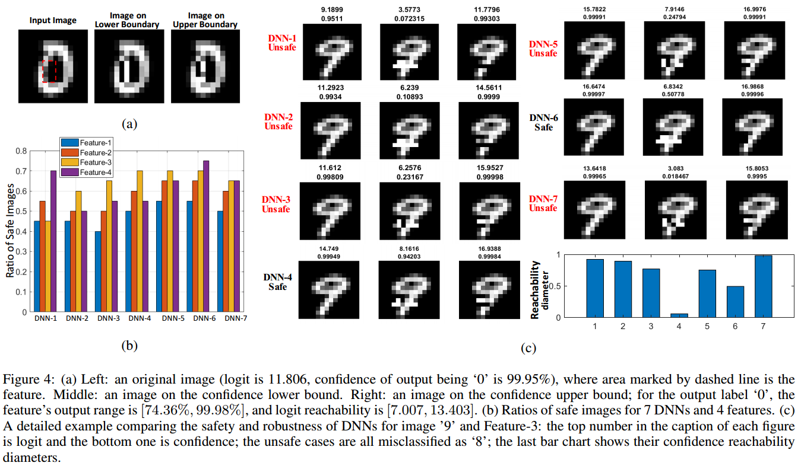
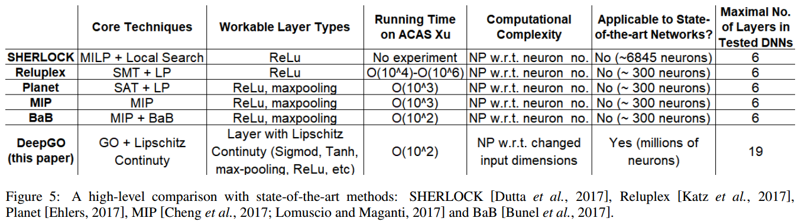

# DeepGO: Reachability Analysis of Deep Neural Networks with Provable Guarantees

Reachability Analysis of Deep Neural Networks with Provable Guarantees

Authors: Wenjie Ruan, Xiaowei Huang, Marta Kwiatkowska

To be appear by 27th International Joint Conference on Artificial Intelligence (IJCAI'18)

The long version can be found in https://arxiv.org/abs/1805.02242 


# Abstract
Verifying correctness of deep neural networks (DNNs) is challenging. We study a generic reachability problem for feed-forward DNNs which, for a given set of inputs to the network and a Lipschitz-continuous function over its outputs, computes the lower and upper bound on the function values. Because the network and the function are Lipschitz continuous, all values in the interval between the lower and upper bound are reachable. We show how to obtain the safety verification problem, the output range analysis problem and a robustness measure by instantiating the reachability problem. We present a novel algorithm based on adaptive nested optimisation to solve the reachability problem. The technique has been implemented and evaluated on a range of DNNs, demonstrating its efficiency, scalability and ability to handle a broader class of networks than state-of-the-art verification approaches. 


# Sample Results








# Software

Matlab 2018a

Neural Network Toolbox

Image Processing Toolbox

Parallel Computing Toolbox

# Run

## Contain two folders:

### Experiment1_FunctionNN 

code for the experiment 6.1 in the paper Lipschitz constant is set before searching

### Experiment2_DNN_MNIST

code for the experiment 6.2 in the paper Lipschitz constant is dynamic estimated during the searching

# Citation
```
@article{RHK2018,
	Author = {Wenjie Ruan and Xiaowei Huang and Marta Kwiatkowska},
	Journal = { The 27th International Joint Conference on Artificial Intelligence (IJCAI)},
	Title = {Reachability Analysis of Deep Neural Networks with Provable Guarantees},
	Year = {2018}}
```
or

```
@article{RHK2018arXiv,
	Author = {Wenjie Ruan and Xiaowei Huang and Marta Kwiatkowska},
	Journal = {arXiv preprint arXiv:1805.02242},
	Title = {Reachability Analysis of Deep Neural Networks with Provable Guarantees},
	Year = {2018}}
```
